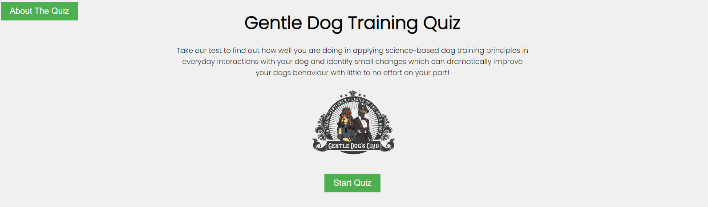
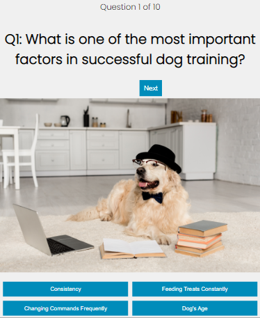
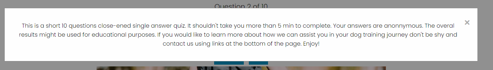
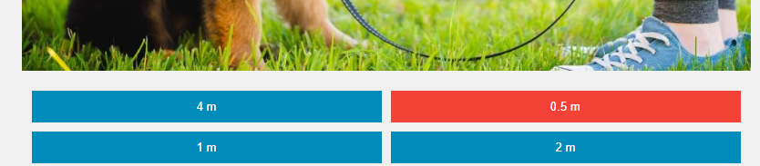
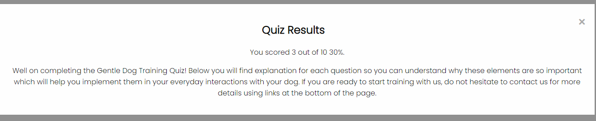
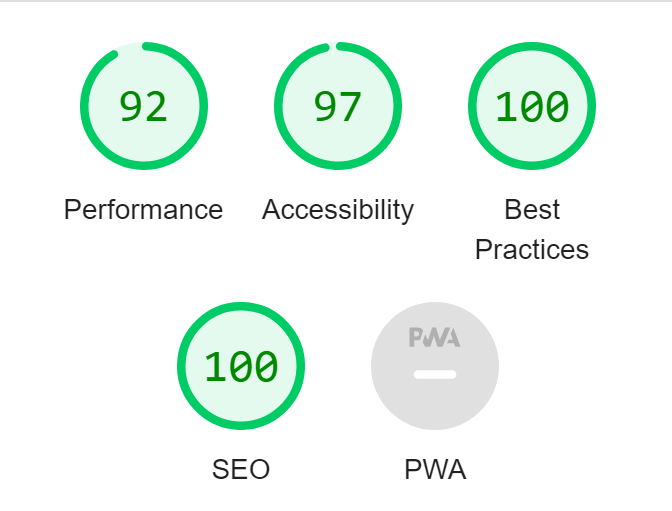

# Gentle Dog Training Quiz

### [View live website here](https://gentle-programmer.github.io/CI-Project-Dog-Training-Quiz/) 

## Overview

The Gentle Dog Training Quiz is a fun and engaging web-based quiz game designed to test users' knowledge about science-based dog training techniques, tips and strategies. The quiz contains single-choice questions with varying levels of difficulty focusing on practical side of training. It is designed to be responsive and mobile-friendly, making it easy for users to engage with it on various devices.

## User Stories

### 1. As a User, I want to learn more about the ways to train dogs. I want to easily navigate through the quiz abd view my results at the end.
### 2. As a Dog Owner, I want to test my knowledge about dog training to ensure I'm providing the best possible training for my dog so that we can have a happy and healthy relationship.
### 3. As a Dog Trainer or Animal Rescue Manager, I want to use the quiz as an educational tool for my clients to help them better understand important concepts of dog training and reinforce concepts covered in educational materials.
### 4. As a Dog Lover, I want to have fun answering questions on dog training and learn something new in the process.

## Target Audience

The primary target audience for the Gentle Dog Training Quiz includes:

### Dog Owners who want to learn about positive dog traiing techniques abd tips to provide better care and training for their pets.
### Aspiring or professional dog trainers who want to test their knowledge and keep up-to-date with the latest dog training concepts.
### Dog enthusiasts who enjoy learning about dogs and want to challenge themselves with a fun and engaging quiz.
### General users who may be considering adopting a dog and want to educate themselves about dog training before commiting and find a reputable training provider.

## Features

### Responsive design: The quiz is mobile-friendly and can be accessed on various devices, including smartphones, tablets and desktops.

### Clean main page design

### Single-choice answers: Only one answers per question is correct to make the quiz fun and enjoyable without making it too challenging.
### Progress tracking: Users can view the current question number and total number of questions throughout the quiz.

### Information modal: Users can learn more about the purpose of the quiz by clicking on About the Quiz button in upper left corner of the page.

### Navigation: Users can navigate between questions using 'Next' and 'Previous' buttons.
### Two-second delay between displaying the feedback and moving to the next question, to allow users to see the correct answer and process their feedback.

### Results summary: At the end of the quiz, users can view their score as the percentage of correct answers. Call to action is also included.

### Footer with copyright, author's name, current year and links to author's website and Facebook page.

## Usage

To use the Gentle Dog Training Quiz, simply open the HTML file in a web browser. When the quiz loads, click the 'Start Quiz' button to begin. Answer the questions by clicking on the option buttons below. Use the 'Next' and 'Previous' buttons to navigate between questions. After completing the quiz, a results modal will display your score.

## Future Enhancements

Posible future enhancements for the Gentle Dog Training Quiz include:

### Education: Add educational summary to the results section, potentially dynamically linked to the user's answers to provide tailored summary addressing knowledge gaps.
### Leaderboard: Implement a leaderboard system to allow users to compare their scores with other players and assign prices or pre-selected training solutions depending on the user's score.
### Categories: Add different categories of questions related to dog training such as puppy training, obedience training and behaviour issues.
### Question bank: Expand the question bank with more questions and add a feature to randomly select questions for each quiz attempt.
### User registration: Allow users to create account and track their progress and performance over time as well as support upselling of the training content tailored to user's needs.
### Customization: Provide options for users to customize the quiz, such as the number of questions, difficulty level, or category selection.
### Social sharing: Enable users to share their results on social media platforms such as Facebook, Twitter and Instagram.
### Marketing automation: Further automation of sales process can be included to utilyse the quiz as an effective marketing tool.

## Testing

### Functionality Testing

I used Mozilla web developer tools and Chrome developer tools throughout the project for testing and solving problems with responsiveness and style issues.

### Compatibility Testing

Site was tested across multiple virtual mobile devices and browsers. I checked all supported devices in both Mozilla web developer tools and Chrome developer tools.
I tested on hardware devices such as: 14' screen HP laptop, 17' screen Asus laptop, 27' hp monitor, Samsung s20fe, Samsung s7edge and Samsung Note 10.

### Performance Testing

I run [Lighthouse](https://developers.google.com/web/tools/lighthouse/) tool to check performance of the website .

### Validator Testing

- HTML
    - No errors were found upon final validation using [W3C validator](https://validator.w3.org/#validate_by_input).

- CSS
    - No errors were found upon validation using [Jigsaw validator](https://jigsaw.w3.org/css-validator/validator).

- JavaScript
    - No errors were found when passing through [Jshint validator](https://jshint.com/).

### Bugs to be Resolved

No bugs identified after testing phase. 

- One warning highlited upon html validation refering to line 41 of html code 'Warning: Empty heading. From line 41, column 9; to line 41, column 29, <h2 class="question"></h2> The empty heading has dynamic content assigned from JavaScript therefore it remains empty.
- Two undefined variables highlighted upon JavaScript validation line 197 target and line 219 startBtn. 

## Deployment

The project was deployed on GitHub Pages. GitPod was used as a development environment where I commited all changes to git version control system. I used push command to save changes to GitHub.

To deploy a project:

- Log in to GitHub and click on repository to deploy ([CI-Project-Dog-Training-Quiz](https://github.com/Gentle-Programmer/CI-Project-Dog-Training-Quiz))
- select `Settings` and find GitHub Pages section on the left hand side.
- from source select `Classic Pages experience` and then `main` branch.
- click `save` and page was deployed after auto-refresh.

[View live website here](https://gentle-programmer.github.io/CI-Project-Dog-Training-Quiz/)

To run localy:

- Log in to GitHub and click on repository to download ([CI-Project-Dog-Training-Quiz](https://github.com/Gentle-Programmer/CI-Project-Dog-Training-Quiz))
- select `Code` and click Download the ZIP file.
- after download you can extract the file and use it in your local environment

Alternatively you can [Clone](https://docs.github.com/en/free-pro-team@latest/github/creating-cloning-and-archiving-repositories/cloning-a-repository)
or [Fork](https://docs.github.com/en/free-pro-team@latest/github/getting-started-with-github/fork-a-repo)
this repository ([CI-Project-Dog-Training-Quiz](https://github.com/Gentle-Programmer/CI-Project-Dog-Training-Quiz)) into your github account.

## Credits

Big thanks to my tutor Michal Krawczyk for his knowledge and support through out this project.

- Ideas and knowledge library:

  - [w3schools.com](https://www.w3schools.com)

  - [css-tricks.com](https://css-tricks.com/)

  - [developer.mozilla.org/](https://developer.mozilla.org/)

  - How to implement modal [Modal](https://www.youtube.com/watch?v=XH5OW46yO8I), [Modal Creation](https://www.youtube.com/watch?v=6ophW7Ask_0)

  - Build A Quiz App With JavaScript [Quiz App](https://www.youtube.com/watch?v=riDzcEQbX6k) ; [Quiz App with Javascript - Object Oriented Programming](https://www.youtube.com/watch?v=jvk1pFNqXaw) ; [Quiz App 3](https://www.youtube.com/watch?v=f4fB9Xg2JEY) 

  - [JavaScript DOM creation Part 1](https://www.youtube.com/watch?v=0ik6X4DJKCc) ; [JavaScript DOM creation Part 2](https://www.youtube.com/watch?v=mPd2aJXCZ2g) ; [JavaScript DOM creation Part 3](https://www.youtube.com/watch?v=wK2cBMcDTss)

  - [Responsive Web Design](https://www.youtube.com/watch?v=srvUrASNj0s)

  - [CSS Flexbox](https://www.youtube.com/watch?v=JJSoEo8JSnc)

### Content

- All questions were created by Gentle Dog's Club Head Trainer

### Media

- The logo is an official business logo of [Gentle Dog's Club](https://gentledogsclub.ie) trading in Dublin, Ireland.
- All photos used were purchaised by Gentle Dog's Club from [Shutterstock](https://shutterstock.com) 
- Fonts [Google fonts - Poppins](https://fonts.google.com/)
- Colors used: #f0f0f0; #4CAF50; #45a049; rgba(0, 0, 0, 0.4); fefefe; #888; #aaa; #008cba; #0073b7; #f44336

## Technologies Used

### HTML5

- As a structure language.

### CSS

- As a style language.

### JavaScript

- As a functionality script.

### Google Fonts

- As a font resource.

### GitHub

- As a software hosting platform to keep project in a remote location.

### Git

- As a version-control system tracking.

### GitPod

- As a development hosting platform.
